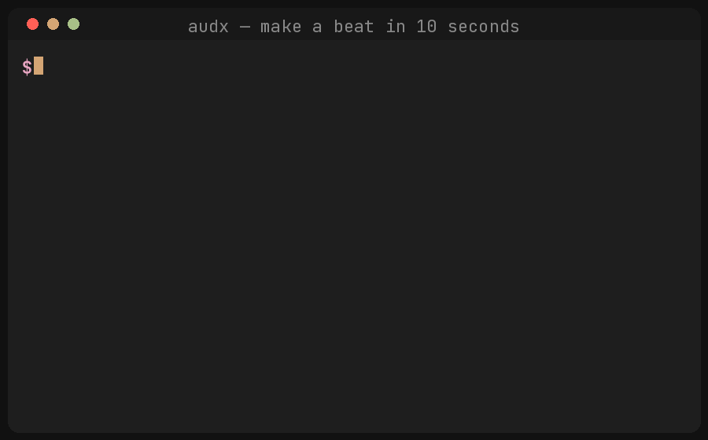

<div align="center">

# audx

A terminal-native digital audio workstation for pattern sequencing, live-coded sample playback, and Ableton session export. Built for a calm, local, hackable workflow with zero cloud dependency.

**v0.3 experimental** — core music tools work; some advanced CLI surfaces are still experimental.

[Try the browser studio](https://audx-five.vercel.app) · [Type a pattern](https://audx-five.vercel.app/play.html) · [GitHub](https://github.com/chrisschouk/audx)



</div>

## Try it in the browser (no install)

Open **[audx studio](https://audx-five.vercel.app/studio.html)** — build a groove with the real synth kit, export WAV/stems, or share a link. Web MIDI / Push 2 works best in Chromium.

Or open the **[pattern playground](https://audx-five.vercel.app/play.html)** and type DSL like `kick 4/4`.

---

## Terminal quickstart

```bash
python3 -m venv .venv
source .venv/bin/activate
python -m pip install "git+https://github.com/chrisschouk/audx.git"

# Offline proof — no samples, no audio hardware required
audx doctor
audx demo loop.wav
```

> **Note:** `pip install audx` on PyPI is a *different* unrelated package. Install from this GitHub repo as shown above until a dedicated PyPI name ships.

### Live jam (needs PortAudio + optional MIDI)

```bash
# Native audio drivers
brew install portaudio               # macOS
# or: sudo apt install libportaudio2   # Linux

audx samples scan                    # optional: index local samples
audx jam                             # drum pads / Push 2
audx jam --genre techno              # pads + looping techno patterns @ 128 BPM
audx open my-track                   # terminal DAW TUI
audx open my-track --serve           # TUI + read-only live dashboard on :8080
audx export als my-track/project.audx
audx song render my-track/project.audx
```

---

## Commands that work today

```bash
audx doctor                             # Diagnostics (PortAudio, MIDI, CLI stack)
audx demo [out.wav]                     # Render a synth-kit demo beat (offline)
audx jam [--genre techno|house|hiphop|ukg|ambient]
                                        # Live MIDI jam; --genre loads a pattern pack
audx jam --chromatic                    # Pitched chromatic synth keyboard mode
audx samples scan                       # Auto-scan ~/Music, ~/Downloads, ~/Samples
audx init <name>                        # Scaffold project folder
audx open [project] [--serve]           # Terminal TUI; optional read-only dashboard
audx serve --port 8080                  # Read-only live monitor dashboard
audx push2 lights                       # Test Push 2 pad LED grid
audx push2 map                          # Print Push 2 MIDI mapping scaffold
audx midi list                          # List MIDI ports
audx midi out "Push 2"                  # Send 24 PPQN MIDI clock
audx midi rec <name> --bars 1           # Record incoming MIDI as a pattern
audx export als project.audx            # Export Ableton Live Set (.als)
audx export midi out.mid                # Export Standard MIDI File
audx song render project.audx           # Render project to WAV
audx pattern create <name> "<dsl>"      # Parse/check a pattern
audx pattern set <ch> "<dsl>"           # Replace a channel's DSL line
audx pattern list                       # List patterns in current process
audx synths                             # List built-in synth voices
audx stems search 909 kick              # Fuzzy-search the sample index
audx diff a.audx b.audx                 # Human-readable project diff
audx fork project new-name              # Cheap branching
audx save beat.audx / audx load beat.audx
audx projects list
audx watch project.audx                 # Hot-reload .audx on save
audx version
```

Experimental / optional bridges (need extra local services or are incomplete): `audx finish`, plugin scan, voice, AI extras. See source for details — not part of the happy path yet.

---

## Troubleshooting

### `zsh: command not found: pip`
Use `python3 -m pip` or a venv (see quickstart above).

### PEP 668 `externally-managed-environment`
Always install inside a venv on Homebrew/macOS Python.

### Real-time audio fails
Install PortAudio (`brew install portaudio` / `apt install libportaudio2`). Offline `audx demo` and render still work without it.

---

## Pattern DSL

```bash
audx pattern create kick "kick 4/4"                          # four on the floor
audx pattern create snare "snare 2/8"                        # beats 2 and 4
audx pattern create hats "hh 16x8 | vel 0.45 | channel 2"    # 8 hats over 16 steps
audx pattern create groove "x--- -x-- --x- ---x"             # x/rest grid
audx pattern create perc "perc e(5,16,2)"                    # Euclidean, rotated
audx pattern create clap "clap [1.0.1.0.1.1.0.0]"            # explicit grid
```

---

## Development

```bash
make dev
uv run pytest -q
uv run ruff check src tests
uv run mypy src/audx
cd web && npm ci && npm test && npm run build
```

---

## Philosophy

> Code is the controller. Sound is the canvas. Terminal is the dimension.

Local-first. Hackable. No cloud lock-in. MIT licensed.
